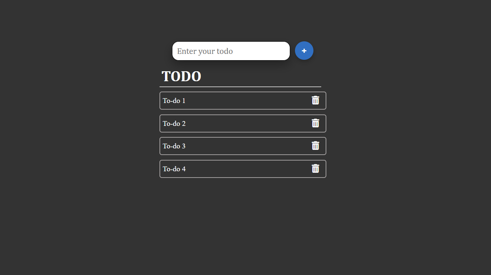

# React-Todo-App
Todo list app project using react hooks
Here is the screenshot of the project.

<h3>Functionalities:</h3>
<ol>
  <li> Add Todo by clicking add button</li>
  <li> Add Todo by pressing Enter key</li>
  <li> Delete Todo</li>
 </ol>